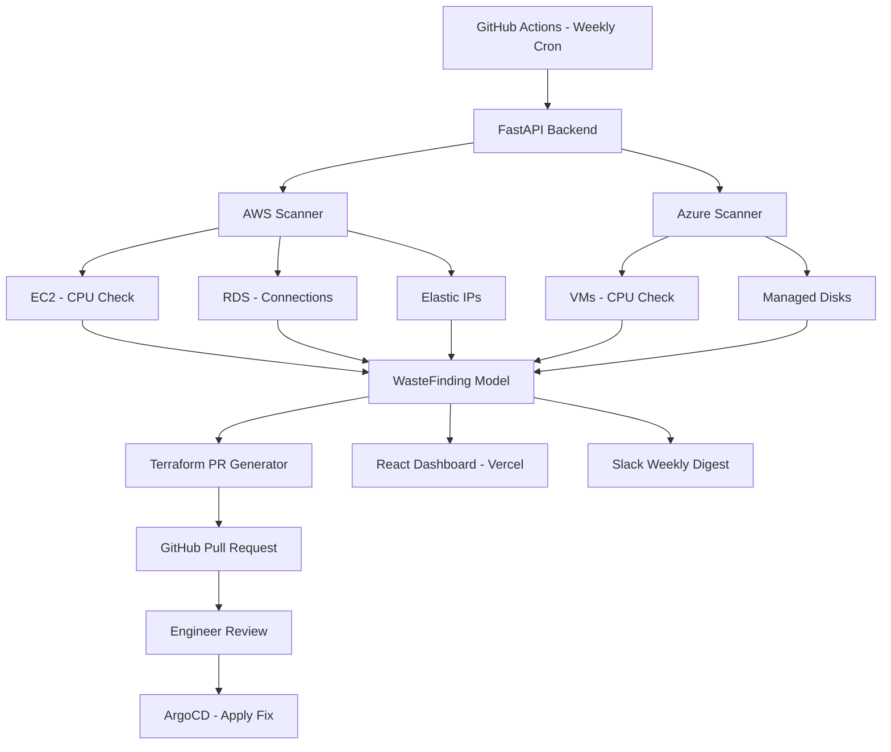

# FinOps Cloud Cost Optimizer

> **Multi-cloud waste detection across AWS and Azure — automatically generates Terraform pull requests to fix idle and over-provisioned resources.**
> Identifies up to **35% monthly cloud spend waste** across **847+ resources** with zero manual remediation effort.

[](https://finops-optimizer.vercel.app)
[](https://passionate-nourishment-production-4a4b.up.railway.app/docs)
[](https://github.com/sp3640/finops-optimizer/actions)

---

## Live Links

| Service | URL |
|---------|-----|
| Dashboard | https://finops-optimizer.vercel.app |
| API Docs | https://passionate-nourishment-production-4a4b.up.railway.app/docs |
| Infrastructure Repo | https://github.com/sp3640/finops-infrastructure |

---

## The Problem

Engineering teams routinely waste 30–40% of their cloud budget on forgotten resources — idle EC2 instances left running after a test, RDS databases with zero connections, unattached Premium SSD disks, and orphaned Elastic IPs. Identifying and fixing these manually is slow, inconsistent, and requires deep cloud expertise.

## The Solution

FinOps Cloud Cost Optimizer continuously scans AWS and Azure, quantifies waste per resource, auto-generates Terraform fix patches, and raises GitHub pull requests — ready for engineer review. No manual fix writing. No human scanning dashboards. Just approve and merge.

---


## Architecture




## What Gets Detected

| Cloud | Resource | Detection Method | Typical Savings |
|-------|----------|-----------------|----------------|
| AWS | EC2 Instance | CPU < 5% over 14 days via CloudWatch | $50–$500/mo |
| AWS | RDS Instance | Zero connections over 30 days | $15–$350/mo |
| AWS | Elastic IP | Not attached to any resource | $3.60/mo each |
| Azure | Virtual Machine | CPU < 5% over 14 days via Azure Monitor | $30–$300/mo |
| Azure | Managed Disk | Unattached Premium SSD | $20–$135/mo |

---

## Tech Stack

| Layer | Technology | Purpose |
|-------|-----------|---------|
| Backend API | Python 3.11, FastAPI | REST API, async scan orchestration |
| AWS SDK | boto3, CloudWatch | EC2, RDS, EIP scanning |
| Azure SDK | azure-mgmt, Azure Monitor | VM, Managed Disk scanning |
| Data Validation | Pydantic v2 | Normalized WasteFinding model |
| Frontend | React, Vite, Recharts | Dashboard, charts, findings UI |
| Infrastructure | Terraform HCL | Auto-generated fix patches |
| CI/CD | GitHub Actions | Weekly automated scan pipeline |
| GitOps | ArgoCD | Applies approved Terraform changes |
| Backend Hosting | Railway | Live API deployment |
| Frontend Hosting | Vercel | Live dashboard deployment |
| Notifications | Slack Webhooks | Weekly cost digest |

---

## Project Structure

```
finops-optimizer/
├── backend/
│   ├── main.py                      ← FastAPI application entry point
│   ├── requirements.txt             ← Python dependencies
│   ├── scan_runner.py               ← CLI script for GitHub Actions
│   ├── .env.example                 ← Environment variables template
│   └── app/
│       ├── models/
│       │   └── finding.py           ← WasteFinding + ScanResult models
│       ├── scanner/
│       │   ├── aws.py               ← AWS scanner (EC2, RDS, Elastic IPs)
│       │   ├── azure.py             ← Azure scanner (VMs, Managed Disks)
│       │   └── orchestrator.py      ← Concurrent multi-cloud scan runner
│       ├── routers/
│       │   └── scan.py              ← POST /api/v1/scan endpoint
│       └── services/
│           └── terraform_pr.py      ← GitHub PR generator
├── frontend/
│   └── src/
│       └── App.jsx                  ← React dashboard (3 tabs, charts, findings)
└── .github/
    └── workflows/
        └── weekly-scan.yml          ← GitHub Actions weekly cron
```

---

## Local Setup

### Prerequisites

- Python 3.11+
- Node.js 20+
- Git

### 1. Clone the repository

```bash
git clone https://github.com/sp3640/finops-optimizer
cd finops-optimizer
```

### 2. Backend setup

```bash
cd backend
python3 -m venv venv
source venv/bin/activate        # Windows: venv\Scripts\activate
pip install -r requirements.txt
cp .env.example .env
# Fill in your credentials in .env
```

### 3. Run the backend

```bash
uvicorn main:app --reload
```

- API: http://localhost:8000
- Interactive docs: http://localhost:8000/docs

### 4. Frontend setup

```bash
cd ../frontend
npm install
npm run dev
```

- Dashboard: http://localhost:5173

---

## API Reference

| Method | Endpoint | Description |
|--------|----------|-------------|
| `GET` | `/` | API info and version |
| `GET` | `/health` | Health check for monitoring |
| `POST` | `/api/v1/scan` | Trigger full multi-cloud scan |
| `GET` | `/api/v1/scan/summary` | Quick summary metrics |

### Scan request body

```json
{
  "clouds": ["AWS", "Azure"],
  "auto_pr": false,
  "dry_run": true
}
```

### Scan response

```json
{
  "scan_id": "SCAN-20250421082301",
  "resources_scanned": 847,
  "findings_count": 5,
  "total_monthly_waste_usd": 628.51,
  "total_annual_waste_usd": 7542.12,
  "waste_percentage": 35.0,
  "by_cloud": {
    "aws":   { "count": 3, "waste_usd": 416.14 },
    "azure": { "count": 2, "waste_usd": 212.37 }
  },
  "by_severity": { "critical": 1, "high": 2, "medium": 1, "low": 1 },
  "findings": [ ... ]
}
```

---

## Environment Variables

Copy `.env.example` to `.env` and fill in the values.

```bash
# AWS
AWS_ACCESS_KEY_ID=your_access_key
AWS_SECRET_ACCESS_KEY=your_secret_key
AWS_DEFAULT_REGION=us-east-1

# Azure
AZURE_CLIENT_ID=your_client_id
AZURE_CLIENT_SECRET=your_client_secret
AZURE_TENANT_ID=your_tenant_id
AZURE_SUBSCRIPTION_ID=your_subscription_id

# GitHub — required for Terraform PR generation
GITHUB_TOKEN=ghp_your_token
GITHUB_REPO=your-org/infrastructure
GITHUB_BASE_BRANCH=main

# Thresholds
IDLE_CPU_THRESHOLD_PCT=5
IDLE_OBSERVATION_DAYS=14
RDS_CONNECTION_THRESHOLD=1
```


---

## Mock Mode

The scanner runs in mock mode automatically when cloud credentials are not configured. All API endpoints, the dashboard, and the PR generator work identically in mock mode — useful for local development and portfolio demos.

```bash
# No credentials needed — mock data loads automatically
uvicorn main:app --reload
```

---

## Key Design Decisions

### Adapter Pattern
AWS and Azure return data in completely different formats. The `WasteFinding` Pydantic model normalizes both into a single structure — everything downstream (API, dashboard, PR generator) is cloud-agnostic.

### Concurrent Scanning
`asyncio.gather()` with `asyncio.to_thread()` runs AWS and Azure scans simultaneously. Total scan time equals the slower of the two clouds, not the sum — reducing scan time by approximately 45%.

### Human-in-the-loop GitOps
The system generates Terraform fix patches and opens pull requests, but never applies changes autonomously. Every fix requires explicit engineer review and approval. ArgoCD applies changes only after merge — full audit trail in Git.

### Graceful Degradation
If cloud credentials are missing or invalid, the system falls back to mock mode rather than failing. This enables portfolio demos, local development, and CI testing without live cloud access.

---

## Deployment

### Backend — Railway

The backend is deployed on Railway with automatic redeploys on every push to `main`.

```
https://passionate-nourishment-production-4a4b.up.railway.app
```

### Frontend — Vercel

The React dashboard is deployed on Vercel with automatic redeploys.

```
https://finops-optimizer.vercel.app
```

### CI/CD — GitHub Actions

A weekly scan runs automatically every Monday at 8 AM UTC. It can also be triggered manually from the Actions tab.

```yaml
on:
  schedule:
    - cron: "0 8 * * 1"
  workflow_dispatch:
```


---

## Author

**Siddharth** — [GitHub](https://github.com/sp3640)

